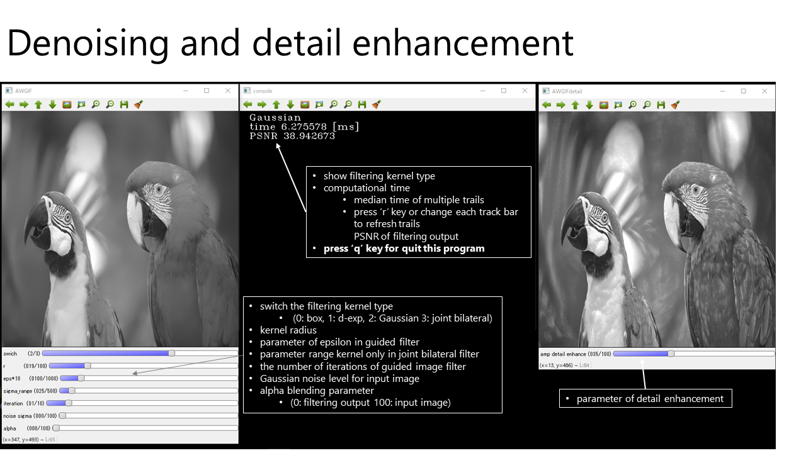
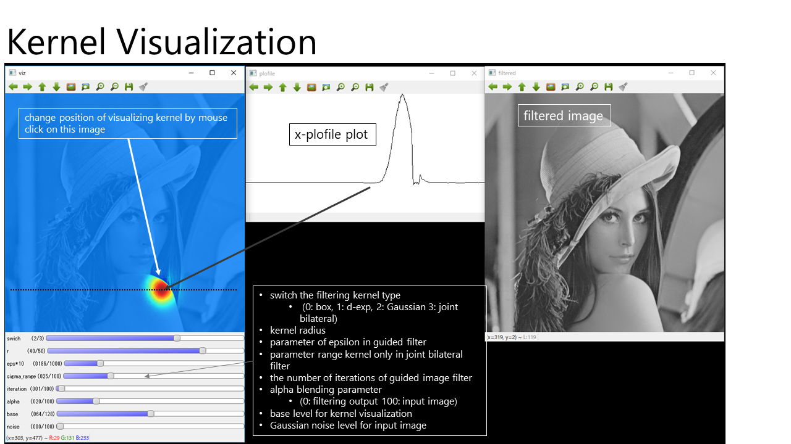
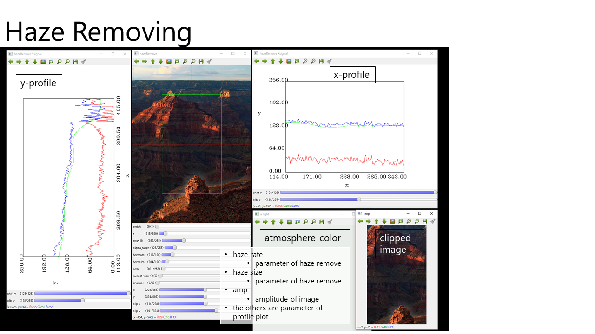

# Guided Image Filtering with Aarbitrary Window Function

Published in ICASSP 2018

* [Project Webpage: http://fukushima.web.nitech.ac.jp/research/awgif/](http://fukushima.web.nitech.ac.jp/research/awgif/)
* [pdf](http://fukushima.web.nitech.ac.jp/paper/2018_icassp_fukushima.pdf)

## class and function lists
The main function includes three tests.

* denoising and detail enhancement
	* ```class ArbitraryWindowedGuidedImageFilter```
	* implementation of the proposed method
* filtering kernel visualization
	* ```class VisualizeKernel, VizKernelAWGIF```
	* implementation of kernel visualization class
* haze removing
	* ```class HazeRemove```
	* implementation of haze removing with the proposed method

There are several implementations of smoothing filtering:

* O(1) Gaussian filter
	* ```void GaussianBlurSR(InputArray src, OutputArray dest, const double sigma)```
* dual exponential smoothing
	* ```void LaplacianSmoothingIIRFilter(Mat& src, Mat& dest, const double sigma_, int opt=VECTOR_AVX)```
		* function implementation
	* ```class LaplacianSmoothingIIR```
		* class implementation for optimization of utilization of image buffers 
* joint bilateral filter
	* ```void jointBilateralFilter(cv::InputArray src, cv::InputArray guide, cv::OutputArray dest, int D, double sigma_color, double sigma_space, int kernelType, int borderType)```
* box filter
	* we use OpenCV for box filtering

These filters are switched in the class of the following method:

```void internal_filter(Mat& src, Mat& dest, int r, Mat& guide=Mat())```

##Usage
press 'q' key to switch experiments.







